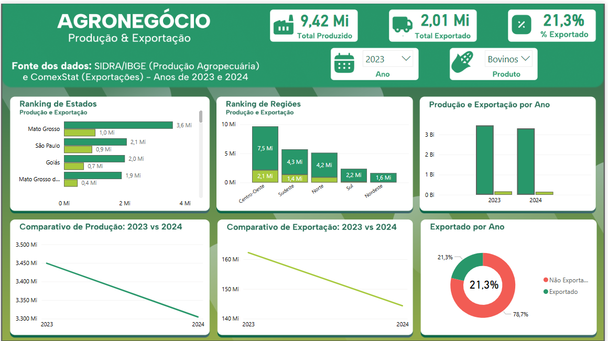

# Dashboard de Exportação Agropecuária | Power BI

Projeto de análise de dados desenvolvido para transformar informações do setor agropecuário em insights estratégicos por meio de visualizações interativas.

## Objetivo

Fornecer insights estratégicos sobre o volume produzido, exportado e consumido internamente de produtos como soja, milho, arroz, carne bovina, carne suína e frango. O dashboard permite identificar os estados e regiões com maior desempenho, além de acompanhar a evolução anual da produção e exportação.

---

## Problema Resolvido

Os dados agropecuários muitas vezes estão dispersos e de difícil interpretação, dificultando a análise de desempenho por região e produto.

Este dashboard resolve esse problema ao consolidar as informações em uma visualização clara e interativa, facilitando a tomada de decisões baseada em dados.

---

## Principais Funcionalidades

- **Slicers interativos**: Produto e Ano
- **Cartões informativos**: Total produzido e total exportado (em toneladas)
- **Gráfico de rosca**: Proporção de produto exportado x consumo interno
- **Gráficos de barras**: Ranking dos estados e regiões que mais produzem e exportam
- **Gráficos de linha**: Evolução anual da produção e exportação
- **Cores e layout personalizados** para uma melhor experiência visual

---

## Imagem do Dashboard

---

## Técnicas Aplicadas

- Modelagem de dados e integridade referencial
- Transformações e agregações com SQL e views
- Criação de medidas DAX customizadas
- Visualização orientada à decisão
- Storytelling com dados
- Uso de boas práticas em design e interação no Power BI

---

## Estrutura do Projeto

├── Documentacao
│ ├── Decisoes_do_Projeto.txt
│ ├── Explicacao_Metodologia.txt
│ └── Fontes_Utilizadas.txt
├── Imagens e Visual
│ └── dashboard.png
├── base_dados
│ ├── arquivos_excel
│ └── scripts_sql
├── dashboard.pbix
└── README.md

---

## Tecnologias Utilizadas

- **Power BI Desktop**
- **SQL (MySQL)**
- **DAX (Data Analysis Expressions)**
- **Excel (limpeza e estruturação inicial)**

---

## Autor

**Daniel Félix**  
Estudante de Análise e Desenvolvimento de Sistemas  
Email: felixdaniel-developer@outlook.com  
LinkedIn: [LinkedIn](https://www.linkedin.com/in/daniel-felix-developer/)

---

## Licença

Este projeto está licenciado sob a licença MIT. Sinta-se à vontade para utilizá-lo como inspiração.
